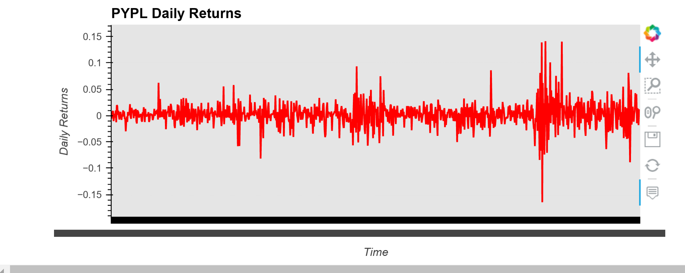
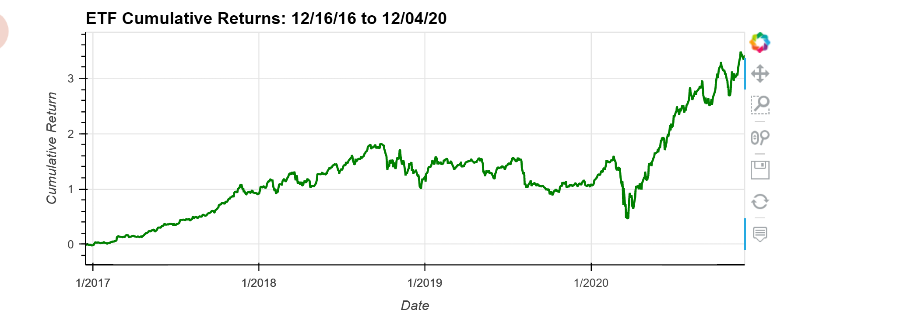
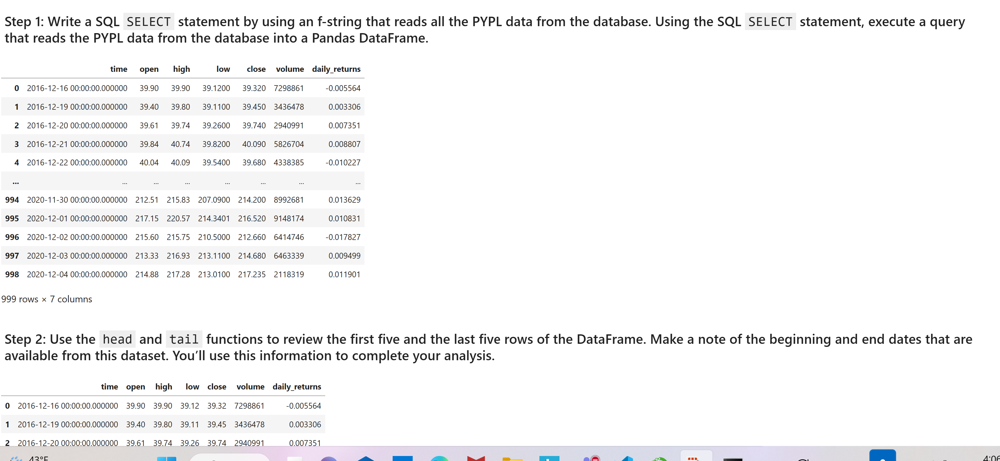
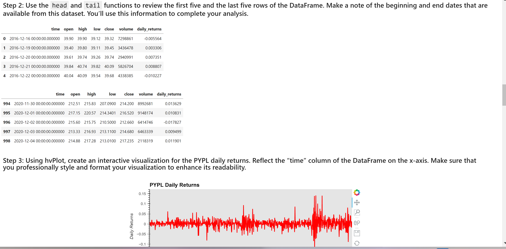
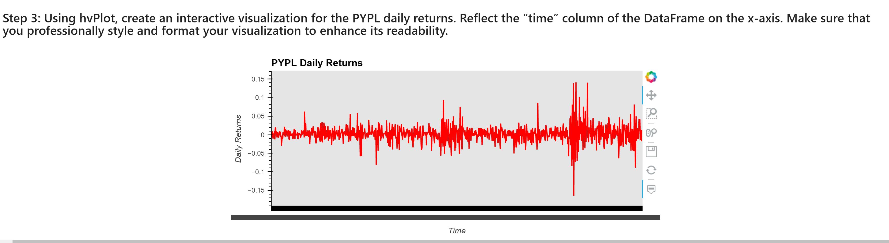
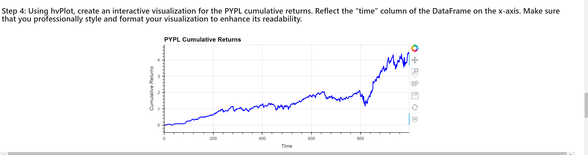
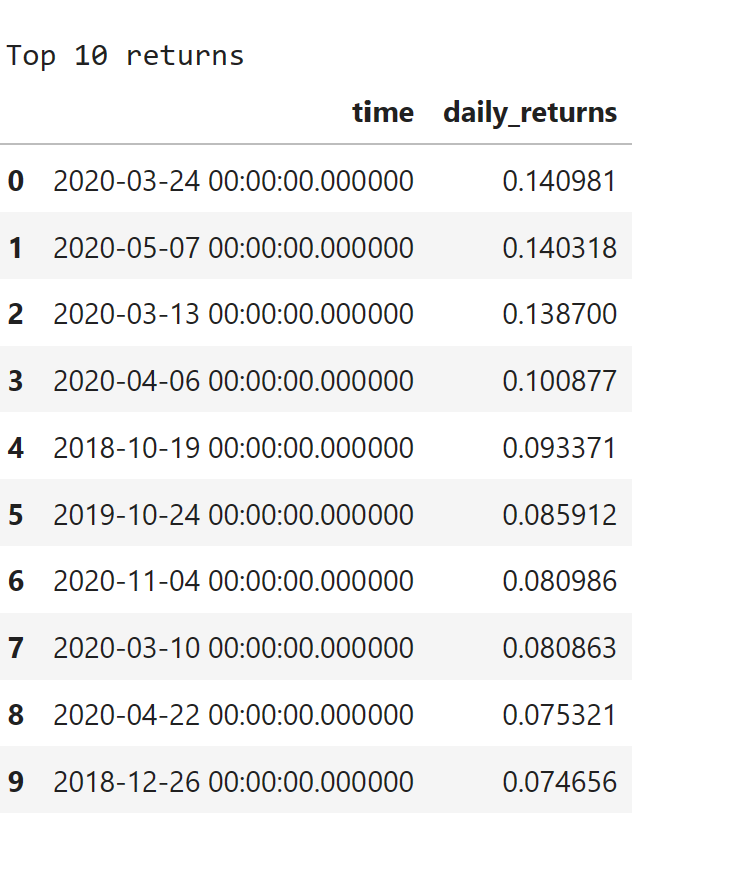
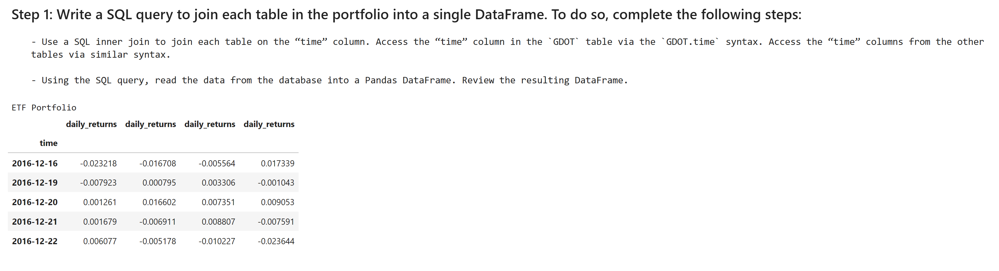
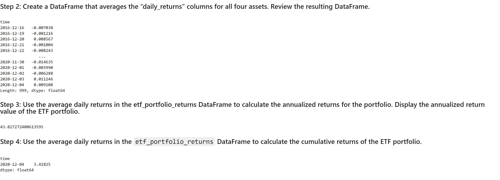
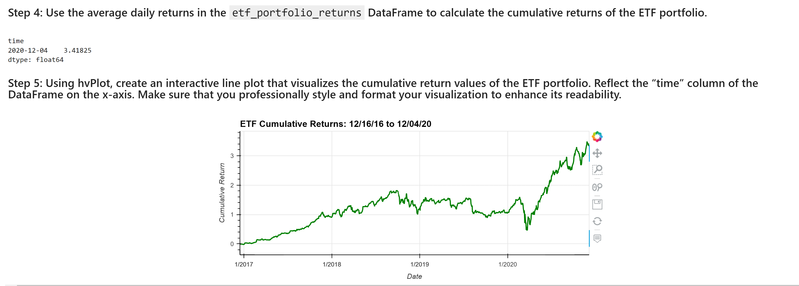

# ETF Analyzer

## Purpose
Analysis of the ETF data and a SQL database including visualizations of data analyzed

### Features
    Visualized data:
    - ETF Daily Returns
    - Cmulative returns 
 
    Viola DEMO page:
    
---
## Technologies
### Python:

    Phyton Version: **3.7.13**

## Libraries and Dependencies

### SQL
[SQL](https://realpython.com/python-requests/)

### Voila
[Voila](https://docs.python.org/3/library/os.html)

### Pandas
[Pandas](https://pandas.pydata.org/pandas-docs/stable/reference/api/pandas.DataFrame.html) 

### Matplotlib
[Matplotlib](https://matplotlib.org/stable/api/_as_gen/matplotlib.pyplot.plot.html)

---
## How to run
1. Clone the repository on a folder
2. Open the file with Jupiter Lab

---
## Usage

### PYPL Daily Returns:

### PYPL Cumulative Returns:

![[pyplcum]](./images/pyplcum.png)

### ETF Portolio Cumulative Returns:

### DEMO with VOILA extension

---
## Contributors
- Startup code provided by UW FinTech Bootcamp

---
## License
Portfolio Risk Analysis tool is available under an MIT License.

---
<!--Aknowledgements -->
## Aknowledgements
* [Markdown Guide](https://www.markdownguide.org/basic-syntax/#reference-style-links)

<!-- MARKDOWN LINKS & IMAGES -->
<!-- https://www.markdownguide.org/basic-syntax/#reference-style-links -->